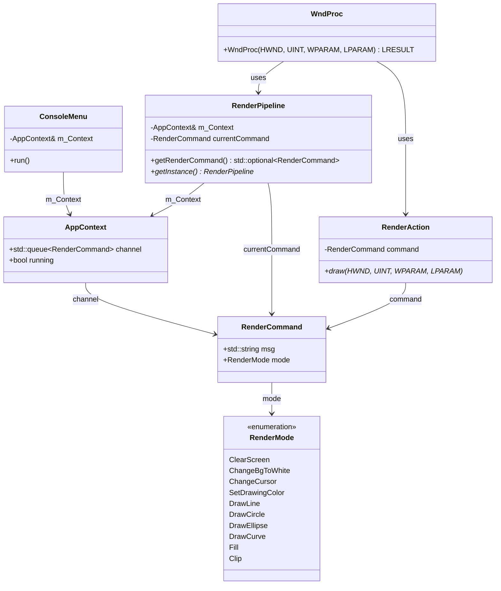

```mermaid
classDiagram
    class AppContext {
        +std::queue~RenderCommand~ channel
        +bool running
    }
    class ConsoleMenu {
        -AppContext& m_Context
        +run()
    }
    class RenderAction {
        -RenderCommand command
        +draw(HWND, UINT, WPARAM, LPARAM)*
    }
    class RenderCommand {
        +std::string msg
        +RenderMode mode
    }
    class RenderMode {
        <<enumeration>>
        ClearScreen
        ChangeBgToWhite
        ChangeCursor
        SetDrawingColor
        DrawLine
        DrawCircle
        DrawEllipse
        DrawCurve
        Fill
        Clip
    }
    class RenderPipeline {
        -AppContext& m_Context
        -RenderCommand currentCommand
        +getRenderCommand() std::optional~RenderCommand~
        +getInstance()* RenderPipeline
    }
    class WndProc {
        +WndProc(HWND, UINT, WPARAM, LPARAM) LRESULT
    }
    AppContext --> RenderCommand : channel
    ConsoleMenu --> AppContext : m_Context
    RenderAction --> RenderCommand : command
    RenderCommand --> RenderMode : mode
    RenderPipeline --> AppContext : m_Context
    RenderPipeline --> RenderCommand : currentCommand
    WndProc --> RenderPipeline : uses
    WndProc --> RenderAction : uses
```